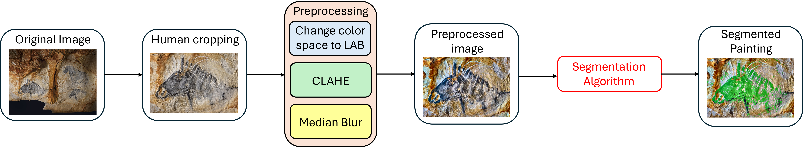

# Segmentation of Cave Paintings

## Overview

<!-- This repository contains the code and resources associated with the article:

> **[Title of Your Paper]**  
> *Authors*, Year. -->

This project focuses on the automatic segmentation of cave paintings from 2D images.  
The primary objective is to extract painted regions (foreground) from complex backgrounds affected by uneven illumination, rock texture, and pigment degradation.


## General Pipeline

The overall processing pipeline is illustrated below:



The segmentation workflow consists of the following main steps:

1. **Human cropping** around the area of interest (typically a specific painting)
2. **Preprocessing:** color space conversion, contrast enhancement (via CLAHE) and noise reduction.  
3. **Foreground extraction using a specific segmentation algorithm**
4. **Final binary mask generation**


## Aim of the Project

Cave paintings present several segmentation challenges:

- Irregular rock surfaces  
- Non-uniform illumination  
- Low contrast between pigments and background  
- Surface degradation and noise  

The goal of this project is to provide:

- A reproducible segmentation framework   
- A modular implementation suitable for heritage imaging applications  
- Baseline tools for further quantitative or morphological analysis  

<!-- This repository accompanies the published article and ensures transparency and reproducibility of the experiments. -->


## Repository Structure

Below is a description of the main files and directories:

### File Description

- **main.py**  
  Entry point for running the full segmentation pipeline.

- **segmentation/preprocessing.py**  
  Color space conversion and luminance extraction.

- **segmentation/otsu_threshold.py**  
  Implementation of Otsu’s automatic threshold selection.

- **segmentation/postprocessing.py**  
  Morphological operations and mask refinement.

- **segmentation/utils.py**  
  Utility functions for visualization and input/output operations.

- **data/raw/**  
  Original input images.

- **data/processed/**  
  Intermediate processed data.

- **results/**  
  Output segmentation masks and evaluation results.

- **requirements.txt**  
  Python dependencies required to run the project.

---

## Installation

```bash
git clone https://github.com/arfiblouisa/Segmentation-of-Cave-Paintings
cd Segmentation-of-Cave-Paintings
pip install -r requirements.txt
```

## Usage :
```bash
python main.py --input path/to/image.jpg --output results/
```

<!-- ## Citation :
@article{yourcitation,
  title={Title},
  author={Authors},
  journal={Journal},
  year={Year}
} -->

## Contact

For questions or collaborations, please contact:
Louisa Arfib : louisa.arfib@student-cs.fr
Manon Arfib : manon.arfib@student-cs.fr