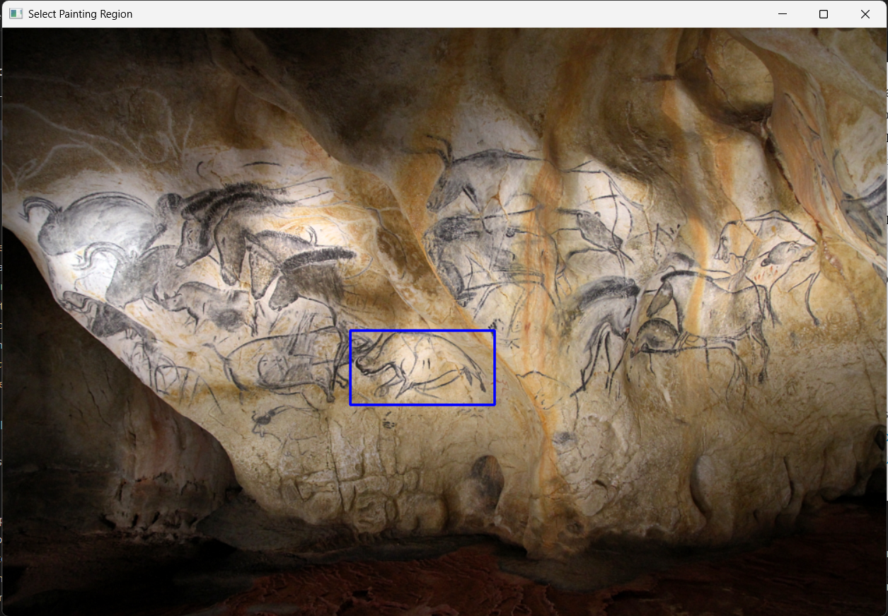
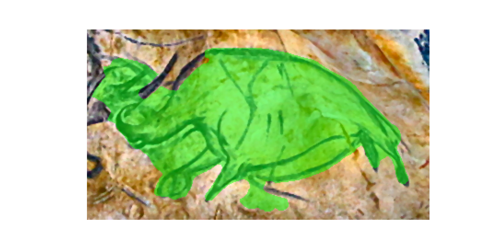
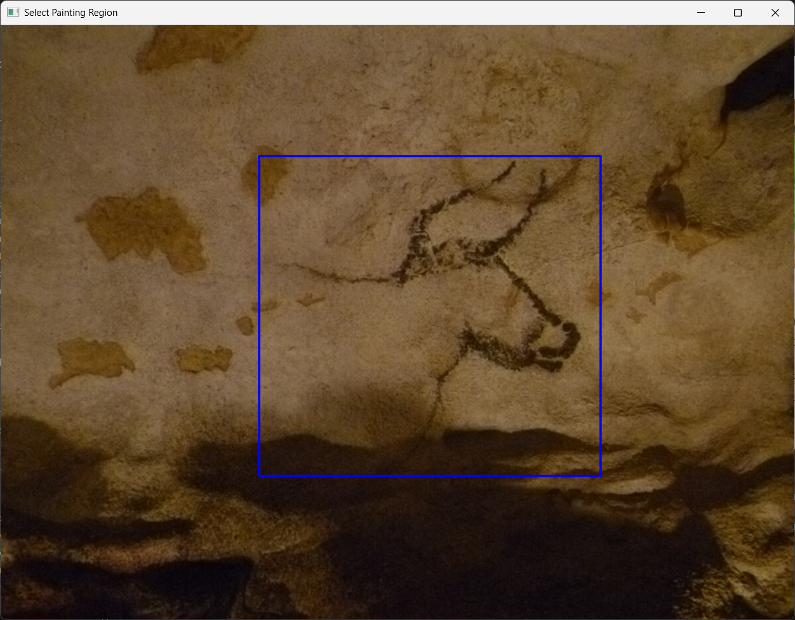
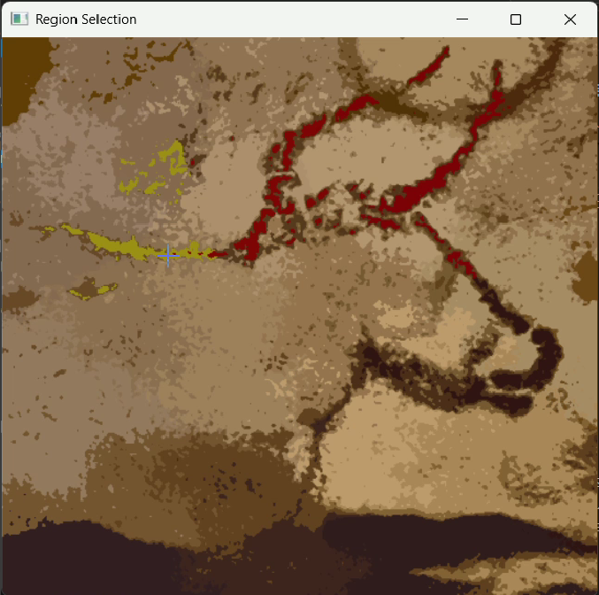
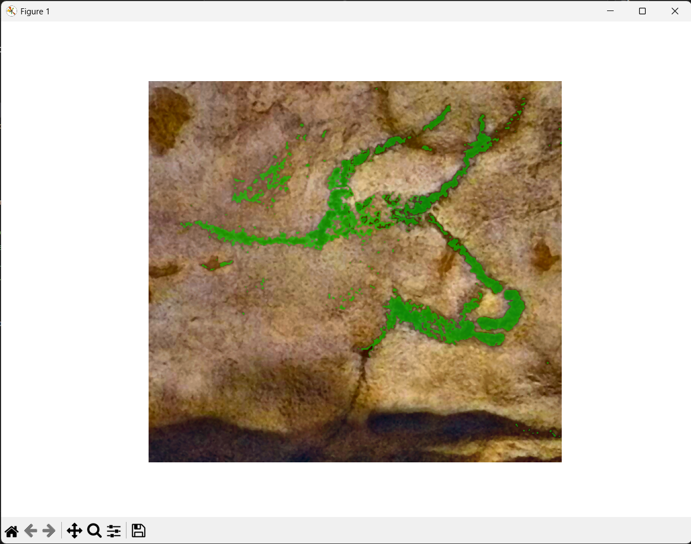

# Segmentation of Cave Paintings

## Overview

<!-- This repository contains the code and resources associated with the article:

> **[Title of Your Paper]**  
> *Authors*, Year. -->

This project focuses on the automatic segmentation of cave paintings from 2D images.  
The primary objective is to extract painted regions (foreground) from complex backgrounds affected by uneven illumination, rock texture, and pigment degradation.


## General Pipeline

The overall processing pipeline is illustrated below:


The segmentation workflow consists of the following main steps:

1. **Human cropping** around the area of interest (typically a specific painting)
2. **Preprocessing:** color space conversion, contrast enhancement (via CLAHE) and noise reduction.  
3. **Foreground extraction using a specific segmentation algorithm**
4. **Final binary mask generation**


## Aim of the Project

Cave paintings present several segmentation challenges:

- Irregular rock surfaces  
- Non-uniform illumination  
- Low contrast between pigments and background  
- Surface degradation and noise  

The goal of this project is to provide:

- A reproducible segmentation framework   
- A modular implementation suitable for heritage imaging applications  
- Baseline tools for further quantitative or morphological analysis  

<!-- This repository accompanies the published article and ensures transparency and reproducibility of the experiments. -->


## Repository Structure

Below is a description of the main files and directories:

- **dataset**
  49 cave paintings images that can be used to test the codes. All images can be used and cited using the *infos.txt* files to correctly cite the authors. 

- **src/seg_cave_paintings**
  All the utils functions used to segment the painting of interest. They are called in *demo_notebooks* and *full_interactive_pipeline*.

- **demo_notebooks**
  Jupyter notebooks to test the three methods described in the article : Otsu, active conctours and meanshift. 
  *get_rectangles_coordinates.py* permits the user to get the bounding box coordinates of the object they want to segment.

- **full_interactive_pipeline**
  Files required to run the complete image segmentation pipeline: the image is first loaded, then you can manually select a bounding box around the object you want to segment, and finally the segmentation algorithm is applied.
  Detailed instructions on how to use this functionality are provided in the **Usage** section of this README.


- **SAM**
  Repository to experiment with SAM3 model. A selection of pictures from *./dataset/* are available in *./SAM/prompt_dataset* to experiment, but other images can be used. 
  *./SAM/SAM3_prompt_experiments.ipynb* should be used to generate the segmentation masks.

- **preprocessing_comparisons**
  Comparisons of different preprocessing methods ono different types of cave paintings (charcoal, red, and both charcoal and red). The different results are presented under .png format.

---

## Installation

We advise you to use Conda for this project. If you intend to run the SAM notebook, you will need to have :
- Python 3.12 or higher
- PyTorch 2.7 or higher
- CUDA-compatible GPU with CUDA 12.6 or higher


1. **Create a new Conda environment:**

```bash
conda create -n seg_cave_env python=3.12
conda activate seg_cave_env
```

2. **Optional : Install PyTorch with CUDA support:**
If you don't intend to re-run the SAM notebook, pythorch isn't needed.
```bash
pip install torch==2.7.0 torchvision torchaudio --index-url https://download.pytorch.org/whl/cu126
```

3. **Clone the repository and install the package:**

Clone our repository and install the package:
```bash
git clone https://github.com/arfiblouisa/Segmentation-of-Cave-Paintings
cd Segmentation-of-Cave-Paintings
pip install -e .
```

Clone SAM3 repository (optional):
```bash
git clone https://github.com/facebookresearch/sam3.git
cd sam3
pip install -e .
```
Install additional SAM dependencies (optional):
```bash
# For running example notebooks
pip install -e ".[notebooks]"
```

⚠️ Before using SAM 3, you need to request access to the checkpoints on the SAM 3
Hugging Face [repo](https://huggingface.co/facebook/sam3). Once accepted, you
need to be authenticated to download the checkpoints. You can do this by running
the following [steps](https://huggingface.co/docs/huggingface_hub/en/quick-start#authentication).

## Usage :

### Notebooks
Can be run immediately. You may want to change the path toward your own image (directly in the notebook).

### `full_interactive_pipeline`

From the root, you must run the command `python full_interactive_pipeline/segment.py algo --image path_toward_your_image`. `algo` can be either `meanshift`, `active_contours` or `otsu`. By default, the parameters used in the article are used to perform the segmentation, but you may change them if you wish by specifying extra arguments: for example `python full_interactive_pipeline/segment.py meanshift --image path_toward_your_image --spatial_radius 100 --color_radius 36`.

An example of use :
- Run `python full_interactive_pipeline/segment.py active_contours --image 'dataset\chauvet\panel-of-the-horses-chauvet-cave-replica-6349.jpg'` (this will apply morphological geodesic active contours)
- Then select a bounding box around what you wish to segment :
<p align="center">
  
</p>

- The final result is displayed :
<p align="center">
  
</p>

If you apply MeanShift algorithm, you can also select the regions you want to merge to create the segmentation mask.
- Run `python full_interactive_pipeline/segment.py meanshift --image 'dataset\lascaux\Lascaux_021.jpg' --spatial_radius 64 --color_radius 16`
- Delineate a bounding box
<p align="center">
  
</p>

- Choose the regions (to merge) that are part of the painting by clicking on them. In red, the region was already selected. If you hover over a region, it highlits in yellow.
<p align="center">
  
</p>

- The final result is displayed
<p align="center">
  
</p>

<!-- ## Citation :
@article{yourcitation,
  title={Title},
  author={Authors},
  journal={Journal},
  year={Year}
} -->

## Contact

For questions or collaborations, please contact:  
Louisa Arfib : louisa.arfib@student-cs.fr  
Manon Arfib : manon.arfib@student-cs.fr